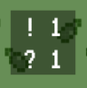
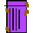
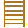

# Roguelike Minesweeper

# What is this?
* I've wrote it to apply for "[Flutter Create](https://flutter.dev/create)", 5KB code restriction contest
* A minesweeper with roguelike (or roguelite) features that wrote by 5KB code.

# Getting Started
* It will run in both Android and iOS, but I only test it in Pixel2 and iOS Simulator(iPhoneXR).
* This app is optimized for FHD resolution(1920*1080)

# Game Rule
* Your goal is to clear level 5 before heart gauge become empty
* Heart gauge decrease with time
* Heart gauge also decrease when unfortunately you reveal a "mine"
* You can reveal a tile by tapping it, and if you found a ladder you can go to next level
* A revealed tile shows hints. The upper number("!") is a number of mine around the tile, and the lower("?") is a number of items or ladder.

 

### Items
You may get an item when reveal a tile.

Bottom right area is item inventory. 
You can use items by a tap.

You can only have 3 items or less.
If you get new item when you already have 3 items, the new item'll be disposed.

You can't dispose a item voluntarily.
A only way make room in inventory is to use items (except "Trash"").

 

#### Explanation

| item name  | effect |
| ------------- | ------------- |
| Heart  | You can heal heart gauge. Healing amount is 50% of consumed. So It's best to use it when heart gauge near the empty. |
| Slash  | Next time you reveal the hidden tile after using it, you can reveal all tiles in same row or same column. (But tiles that have a item or a mine will be skipped.) |
| Shield  | Next time you reveal mine, a damage you receive will be reduced 75%.   |
| Trash  | A useless obstacle. You can't consume it. But it occupy your inventory. You can remove 1 trash when you're damaged by a mine.   |

##### icons
While a Slash or a Shield is in active, the icons appear.

### Special Objects

| item name  | effect |
| ------------- | ------------- |
| Mine  | You lose heart gauge if you found this. |
| Ladder  | You can go to next level if tou tap this. |

# License
The MIT License (MIT)

Copyright (c) 2019 Ryosuke Inamori

Permission is hereby granted, free of charge, to any person obtaining a copy of this software and associated documentation files (the "Software"), to deal in the Software without restriction, including without limitation the rights to use, copy, modify, merge, publish, distribute, sublicense, and/or sell copies of the Software, and to permit persons to whom the Software is furnished to do so, subject to the following conditions:

The above copyright notice and this permission notice shall be included in all copies or substantial portions of the Software.

THE SOFTWARE IS PROVIDED "AS IS", WITHOUT WARRANTY OF ANY KIND, EXPRESS OR IMPLIED, INCLUDING BUT NOT LIMITED TO THE WARRANTIES OF MERCHANTABILITY, FITNESS FOR A PARTICULAR PURPOSE AND NONINFRINGEMENT. IN NO EVENT SHALL THE AUTHORS OR COPYRIGHT HOLDERS BE LIABLE FOR ANY CLAIM, DAMAGES OR OTHER LIABILITY, WHETHER IN AN ACTION OF CONTRACT, TORT OR OTHERWISE, ARISING FROM, OUT OF OR IN CONNECTION WITH THE SOFTWARE OR THE USE OR OTHER DEALINGS IN THE SOFTWARE.

### Assets
* All images and flare animations included in this app are created by myself
* The font is commercial free font "[LCD Solid font](https://www.fontspace.com/lcd-solid/lcd-solid)"
